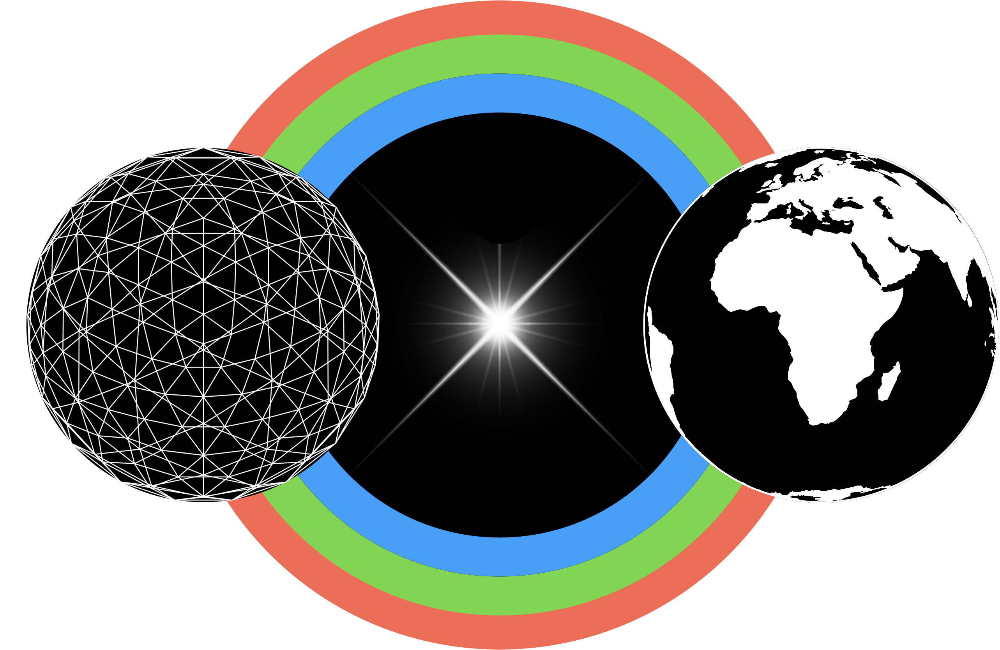

# RainbowBridge

The Rainbow is the most platonic of natural phenomena and for that matter of any experiential phenomena
Therefore it constitutes the bridge between heaven and earth
Noosphere and Biosphere
time-space and space-time

Kasper David Friedrich used the rainbow as a symbol for the connection between God and Man